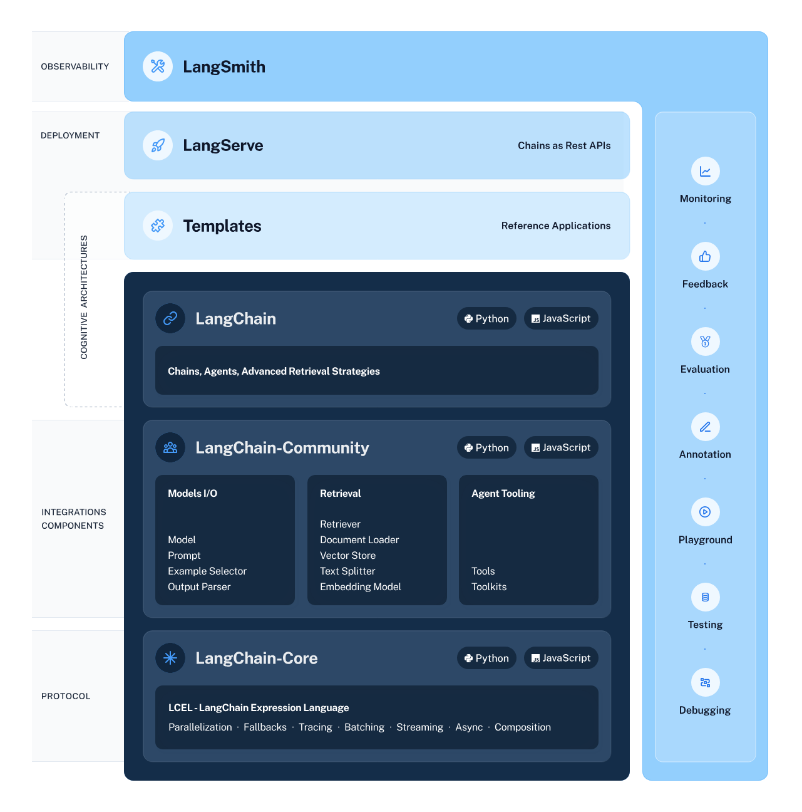
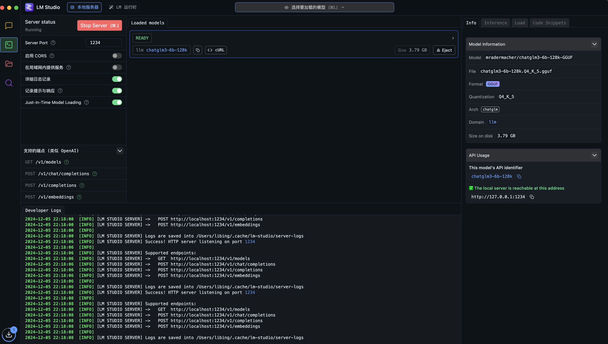

# kk_agent_base AI agent 开发demo

# LangChain 基础使用

## LangChain

LangChain 是一个开源框架，旨在帮助开发者使用大型语言模型（LLMs）和聊天模型构建端到端的应用程序。它提供了一套工具、组件和接口，以简化创建由这些模型支持的应用程序的过程。LangChain 的核心概念包括组件（Components）、链（Chains）、模型输入/输出（Model I/O）、数据连接（Data Connection）、内存（Memory）和代理（Agents）等。


以下是LangChain的一些关键特性和组件的详细解释：

1. **组件（Components）**：
   - **模型输入/输出（Model I/O）**：负责管理与语言模型的交互，包括输入（提示，Prompts）和格式化输出（输出解析器，Output Parsers）。
   - **数据连接（Data Connection）**：管理向量数据存储、内容数据获取和转换，以及向量数据查询。
   - **内存（Memory）**：用于存储和获取对话历史记录的功能模块。
   - **链（Chains）**：串联Memory、Model I/O和Data Connection，以实现串行化的连续对话和推理流程。
   - **代理（Agents）**：基于链进一步串联工具，将语言模型的能力和本地、云服务能力结合。
   - **回调（Callbacks）**：提供了一个回调系统，可连接到请求的各个阶段，便于进行日志记录、追踪等数据导流。

2. **模型输入/输出（Model I/O）**：
   - **LLMs**：与大型语言模型进行接口交互，如OpenAI、Cohere等。
   - **Chat Models**：聊天模型是语言模型的变体，它们以聊天信息列表为输入和输出，提供更结构化的消息。

3. **数据连接（Data Connection）**：
   - **向量数据存储（Vector Stores）**：用于构建私域知识库。
   - **内容数据获取（Document Loaders）**：获取内容数据。
   - **转换（Transformers）**：处理数据转换。
   - **向量数据查询（Retrievers）**：查询向量数据。

4. **内存（Memory）**：
   - 用于存储对话历史记录，以便在连续对话中保持上下文。

5. **链（Chains）**：
   - 是组合在一起以完成特定任务的一系列组件。

6. **代理（Agents）**：
   - 基于链的工具，结合了语言模型的能力和本地、云服务。

7. **回调（Callbacks）**：
   - 提供了一个系统，可以在请求的不同阶段进行日志记录、追踪等。

LangChain 的使用场景包括但不限于文档分析和摘要、聊天机器人、代码分析、工作流自动化、自定义搜索等。它允许开发者将语言模型与外部计算和数据源相结合，从而创建出能够理解和生成自然语言的应用程序。

要开始使用LangChain，开发者需要导入必要的组件和工具，组合这些组件来创建一个可以理解、处理和响应用户输入的应用程序。LangChain 提供了多种组件，例如个人助理、文档问答、聊天机器人、查询表格数据、与API交互等，以支持特定的用例。

LangChain 的官方文档提供了详细的指南和教程，帮助开发者了解如何设置和使用这个框架。开发者可以通过这些资源来学习如何构建和部署基于LangChain的应用程序。


## LangChain可以构建哪些应用


LangChain 作为一个强大的框架，旨在帮助开发者利用大型语言模型（LLMs）构建各种端到端的应用程序。以下是一些可以使用 LangChain 开发的应用类型：

1. **聊天机器人（Chatbots）**：
   - 创建能够与用户进行自然对话的聊天机器人，用于客户服务、娱乐、教育或其他交互式场景。

2. **个人助理（Personal Assistants）**：
   - 开发智能个人助理，帮助用户管理日程、回答问题、执行任务等。

3. **文档分析和摘要（Document Analysis and Summarization）**：
   - 自动分析和总结大量文本数据，提取关键信息，为用户节省阅读时间。

4. **内容创作（Content Creation）**：
   - 利用语言模型生成文章、故事、诗歌、广告文案等创意内容。

5. **代码分析和生成（Code Analysis and Generation）**：
   - 帮助开发者自动生成代码片段，或者提供代码审查和优化建议。

6. **工作流自动化（Workflow Automation）**：
   - 通过自动化处理日常任务和工作流程，提高工作效率。

7. **自定义搜索引擎（Custom Search Engines）**：
   - 结合语言模型的能力，创建能够理解自然语言查询的搜索引擎。

8. **教育和学习辅助（Educational and Learning Aids）**：
   - 开发教育工具，如智能问答系统、学习辅导机器人等，以辅助学习和教学。

9. **数据分析和报告（Data Analysis and Reporting）**：
   - 使用语言模型处理和分析数据，生成易于理解的报告和摘要。

10. **语言翻译（Language Translation）**：
    - 利用语言模型进行实时翻译，支持多语言交流。

11. **情感分析（Sentiment Analysis）**：
    - 分析文本中的情感倾向，用于市场研究、社交媒体监控等。

12. **知识库和问答系统（Knowledge Bases and Q&A Systems）**：
    - 创建能够回答特定领域问题的智能问答系统。

LangChain 的灵活性和模块化设计使得开发者可以根据特定需求定制和扩展应用程序。通过将语言模型与外部数据源和APIs结合，LangChain 能够支持广泛的应用场景，从而创造出更加智能和用户友好的软件解决方案。


## 智谱AI
### 使用智谱ai的GLM4
### GLM-4


新一代基座大模型GLM-4，整体性能相比GLM3全面提升60%，逼近GPT-4；支持更长上下文；更强的多模态；支持更快推理速度，更多并发，大大降低推理成本；同时GLM-4增强了智能体能力。


基础能力（英文）：GLM-4 在 MMLU、GSM8K、MATH、BBH、HellaSwag、HumanEval等数据集上，分别达到GPT-4 94%、95%、91%、99%、90%、100%的水平。


指令跟随能力：GLM-4在IFEval的prompt级别上中、英分别达到GPT-4的88%、85%的水平，在Instruction级别上中、英分别达到GPT-4的90%、89%的水平。


对齐能力：GLM-4在中文对齐能力上整体超过GPT-4。


长文本能力：我们在LongBench（128K）测试集上对多个模型进行评测，GLM-4性能超过 Claude 2.1；在「大海捞针」（128K）实验中，GLM-4的测试结果为 128K以内全绿，做到100%精准召回。


多模态-文生图：CogView3在文生图多个评测指标上，相比DALLE3 约在 91.4% ~99.3%的水平之间。


GLM-4 实现自主根据用户意图，自动理解、规划复杂指令，自由调用网页浏览器、Code Interpreter代码解释器和多模态文生图大模型，以完成复杂任务。
简单来讲，即只需一个指令，GLM-4会自动分析指令，结合上下文选择决定调用合适的工具。


GLM-4能够通过自动调用python解释器，进行复杂计算（例如复杂方程、微积分等），在GSM8K、MATH、Math23K等多个评测集上都取得了接近或同等GPT-4 All Tools的水平。


GLM-4 能够自行规划检索任务、自行选择信息源、自行与信息源交互，在准确率上能够达到 78.08，是GPT-4 All Tools 的116%。


GLM-4 能够根据用户提供的Function描述，自动选择所需 Function并生成参数，以及根据 Function 的返回值生成回复；同时也支持一次输入进行多次 Function 调用，支持包含中文及特殊符号的 Function 名字。这一方面GLM-4 All Tools 与 GPT-4 Turbo 相当。

网站链接： https://www.zhipuai.cn/


## 将chatGLM4封装为langchain的模型

GLM-130B（General Language Modeling）是一种大规模的双语预训练语言模型，它的原理基于Transformer架构，这种架构广泛用于自然语言处理任务，因为它能够有效地捕捉文本中的长距离依赖关系。

### GLM-130B的原理：
1. **Transformer架构**：GLM-130B采用了Transformer模型，该模型基于自注意力机制，能够处理变长序列数据，并在各个层次捕捉文本中的复杂关系。
   
2. **自注意力机制**：模型通过自注意力机制，可以同时考虑输入序列中的所有位置，为每个位置的词分配不同的注意力权重，从而更好地理解上下文。

3. **预训练任务**：GLM-130B在预训练阶段使用了多种任务，如掩码语言模型（Masked Language Modeling, MLM）和下一句预测（Next Sentence Prediction, NSP），以提高模型对语言的理解能力。

4. **双语能力**：GLM-130B特别强调中英双语能力，这意味着它可以同时处理中文和英文数据，为跨语言任务提供支持。

5. **参数高效利用**：尽管参数量巨大，GLM-130B通过有效的训练策略和模型设计，使得参数能够高效地学习和表征语言。

### 训练参数量：
GLM-130B模型的参数量达到了1300亿（130B），这是一个非常庞大的参数规模，使得模型能够捕捉到极其复杂的语言特征和模式。

这样的参数规模使得GLM-130B能够处理大规模的数据集，并在多种语言任务上表现出色。同时，为了能够运行在相对实惠的硬件上，GLM-130B还进行了INT4量化，以减少对计算资源的需求，同时尽量保持性能不受损失。

总的来说，GLM-130B是一个具有强大表达能力的模型，旨在提供高质量的双语语言理解服务。


# 自定义调用本地大模型方法
1. **类属性定义**:
   - `max_token`: 定义了模型可以处理的最大令牌数。
   - `do_sample`: 指定是否在生成文本时采用采样策略。
   - `temperature`: 控制生成文本的随机性，较高的值会产生更多随机性。
   - `top_p`: 一种替代`temperature`的采样策略，这里设置为0.0，意味着不使用。
   - `tokenizer`: 分词器，用于将文本转换为模型可以理解的令牌。
   - `model`: 存储加载的模型对象。
   - `history`: 存储对话历史。
2. **构造函数**:
   - `__init__`: 构造函数初始化了父类的属性。
3. **属性方法**:
   - `_llm_type`: 返回模型的类型，即`ChatGLM3`。
4. **加载模型的方法**:
   - `load_model`: 此方法用于加载模型和分词器。它首先尝试从指定的路径加载分词器，然后加载模型，并将模型设置为评估模式。这里的模型和分词器是从Hugging Face的`transformers`库中加载的。
5. **调用方法**:
   - `_call`: 一个内部方法，用于调用模型。它被设计为可以被子类覆盖。
   - `invoke`: 这个方法使用模型进行聊天。它接受一个提示和一个历史记录，并返回模型的回复和更新后的历史记录。这里使用了模型的方法`chat`来生成回复，并设置了采样、最大长度和温度等参数。
6. **流式方法**:
   - `stream`: 这个方法允许模型逐步返回回复，而不是一次性返回所有内容。这对于长回复或者需要实时显示回复的场景很有用。它通过模型的方法`stream_chat`实现，并逐块返回回复。


## LM Studio

官网链接：https://lmstudio.ai/

LM Studio 是一款桌面应用程序，专门用于本地部署和运行大型语言模型（LLMs）。这个应用的核心优势在于它极大地降低了运行这些复杂模型的技术门槛，让即使是没有编程基础的普通用户也能够轻松地在本地运行这些模型。
主要特点包括：
1. **模型选择与下载**：LM Studio 提供了一个用户友好的界面，用户可以直接从中选择和下载多种大型语言模型。这些模型主要托管在 HuggingFace 网站上，包括一些热门的开源模型，例如 Mistral 7B、Codex、Blender Bot、GPT-Neo 等。
2. **简单直观的操作流程**：用户只需选择喜欢的模型，点击下载，等待下载完成后，通过 LM Studio 的对话界面加载本地模型，就可以开始与 AI 进行对话。
3. **API 转换功能**：LM Studio 还内置了将本地模型快速封装成与 OpenAI 接口兼容的 API 功能。这意味着用户可以将基于 OpenAI 开发的应用程序直接指向本地模型，实现相同的功能，并且完全免费。
4. **易用性和兼容性**：LM Studio 的设计考虑到了易用性和兼容性，使得用户可以轻松地在本地与各种高水平的 AI 模型进行交互。
5. **本地化运行**：该应用支持在本地运行大语言模型，避免了将数据发送到远程服务器的需要，这对于注重数据隐私和安全的用户来说是一个重要的优势。
总的来说，LM Studio 为普通用户提供了便捷的途径来探索和使用大型语言模型，无需复杂的环境配置或编程知识，即可在本地与高级 AI 模型进行交互。



## vLLM
官网链接：https://docs.vllm.ai/en/latest/

vLLM 是由加州大学伯克利分校的 LMSYS 组织开发的一个开源大语言模型高速推理框架。这个框架的主要目的是显著提升语言模型服务在实时场景下的吞吐量和内存使用效率。vLLM 是一个快速且易于使用的库，专门用于大语言模型（LLM）的推理和服务，并且可以与 HuggingFace 无缝集成。
vLLM 框架的核心特点包括：
1. **高性能**：vLLM 在吞吐量方面表现出色，其性能比 Hugging Face Transformers（HF）高出 24 倍，比文本生成推理（TGI）高出 3.5 倍。
2. **创新技术**：vLLM 利用了全新的注意力算法「PagedAttention」，有效地管理注意力键和值，从而提高内存使用效率。
3. **易用性**：vLLM 的主框架由 Python 实现，便于用户进行断点调试。其系统设计工整规范，结构清晰，便于初学者理解和上手。
4. **关键组件**：vLLM 的核心模块包括 LLMEngine、Scheduler、BlockSpaceManager、Worker 和 CacheEngine。这些模块协同工作，实现了高效的推理和内存管理。
5. **显存优化**：vLLM 框架通过其创新的显存管理原理，优化了 GPU 和 CPU 内存的使用，从而提高了系统的性能和效率。
6. **应用广泛**：vLLM 可用于各种自然语言处理和机器学习任务，如文本生成、机器翻译等，为研究人员和开发者提供了一个强大的工具。
综上所述，vLLM 是一个高效、易用且具有创新技术的开源大语言模型推理框架，适用于广泛的自然语言处理和机器学习应用。

## API for Open LLMs
GitHub地址：https://github.com/xusenlinzy/api-for-open-llm

API for Open LLMs 是一个强大的开源大模型统一后端接口，它提供与 OpenAI 相似的响应。这个接口支持多种开源大模型，如 ChatGLM、Chinese-LLaMA-Alpaca、Phoenix、MOSS 等。它允许用户通过简单的 API 调用来使用这些模型，从而提供了一种便捷的方式来运行和部署大型语言模型。
API for Open LLMs 的主要特点包括：
1. **模型支持**：支持多种流行的开源大模型，用户可以根据需要选择不同的模型。
2. **易用性**：提供简单易用的接口，用户可以通过调用这些接口来使用模型的功能，无需关心底层的实现细节。
3. **高效稳定**：采用了先进的深度学习技术，具有高效稳定的运行性能，可以快速处理大量的语言任务。
4. **功能丰富**：提供包括文本生成、问答、翻译等多种语言处理功能，满足不同场景下的需求。
5. **可扩展性**：具有良好的可扩展性，用户可以根据自己的需求对模型进行微调或重新训练，以适应特定的应用场景。
API for Open LLMs 的使用方法非常简单。用户首先需要注册并登录官网获取 API 密钥，然后通过调用相应的 API 接口来使用所需的功能。例如，进行文本翻译时，用户只需调用翻译功能的 API 接口，传递需要翻译的文本作为输入参数，即可获取翻译后的结果。
此外，API for Open LLMs 还支持通过 Docker 启动，用户可以构建 Docker 镜像并启动容器来运行服务。它还提供了本地启动的选项，用户可以在本地安装必要的依赖并运行后端服务。
总的来说，API for Open LLMs 是一个功能强大、高效稳定且易于使用的开源大模型接口，适用于各种自然语言处理任务。

## 提示词模板

语言模型的提示是用户提供的一组指令或输入，用于指导模型的响应，帮助模型理解上下文并生成相关且连贯的基于语言的输出，例如回答问题、完成句子或参与某项活动。对话提示是语言模型在对话系统中使用的提示，它通常包括对话历史、当前对话内容以及用户的输入。

## 提示词案例选择器

当您担心构建的提示会超过上下文窗口的长度时，这非常有用。对于较长的输入，它将选择较少的示例来包含，而对于较短的输入，它将选择更多的示例。

## 最大余弦相似度的嵌入示例
MaxMarginalRelevanceExampleSelector 根据与输入最相似的示例组合来选择示例，同时还针对多样性进行优化。它通过查找与输入具有最大余弦相似度的嵌入示例来实现这一点，然后迭代地添加它们，同时惩罚它们与已选择示例的接近程度。

```
pip install sentence-transformers
pip install faiss-cpu
```

## 通过n-gram重叠选择

NGramOverlapExampleSelector 根据 ngram 重叠得分，根据与输入最相似的示例来选择示例并对其进行排序。 ngram 重叠分数是 0.0 到 1.0 之间的浮点数（含 0.0 和 1.0）。

选择器允许设置阈值分数。 ngram 重叠分数小于或等于阈值的示例被排除。默认情况下，阈值设置为 -1.0，因此不会排除任何示例，只会对它们重新排序。将阈值设置为 0.0 将排除与输入没有 ngram 重叠的示例。

## 模型 (LLMs) 的类似少样本提示示例


大模型是一种基于大量数据训练的人工智能模型，具有强大的下游任务自适应能力。相对于传统的人工智能模型，大模型可以处理更多的领域和任务，其优势主要体现在以下几个方面：
1. 参数规模大：大模型拥有上亿甚至千亿级的参数，这使得它们可以处理更加复杂和抽象的任务，具有更强的泛化能力。
2. 数据依赖性：大模型的训练依赖于大量的数据，这些数据覆盖了各种场景和情况，使得大模型能够更好地理解和处理各种复杂的问题。
3. 适应性强：大模型可以适应各种不同的任务和领域，只需要通过少量的样本进行微调，就可以达到很好的效果。

对于少量样本的提示，大模型具有以下优势：
1. 快速适应：大模型具有很强的泛化能力，少量样本的提示可以使其快速适应新的任务和领域。
2. 提高准确度：少量样本的提示可以减少模型的过拟合风险，提高模型的准确度。
3. 节省资源：相对于重新训练模型，少量样本的提示可以节省大量的计算资源和时间。
综上所述，少量样本的提示对于大模型的回答的准确度具有很大的优势，可以提高模型的适应性和准确度，同时节省资源。

## faiss
`faiss` 是一个开源的机器学习库，由Facebook AI Research（FAIR）开发，主要用于高效的大规模向量搜索和聚类。`faiss` 的核心优势在于它为高维向量空间中的数据提供了快速的近似最近邻搜索（ANNS）算法，这对于推荐系统、信息检索、图像和视频分析等应用非常重要。
`faiss` 库的主要作用包括：
1. **向量搜索**：`faiss` 提供了一系列高效的算法来寻找给定向量集合中与查询向量最接近的向量。这包括基于距离的搜索和基于哈希的搜索方法。
2. **聚类**：`faiss` 支持多种聚类算法，如K-means和层次聚类，以及为高维数据优化的聚类方法。
3. **特征编码**：`faiss` 包含了一些特征编码方法，如量化和编码，这些方法可以降低数据的维度，同时保持尽可能多的信息。
4. **IVF（Inverted File）索引**：`faiss` 实现了一种特殊的索引结构，称为倒排文件索引，这种索引允许快速地搜索大量的高维数据。
5. **GPU加速**：`faiss` 库充分利用了NVIDIA GPU的并行计算能力，使得在大规模数据集上的向量搜索和聚类操作变得非常快速。
6. **多线程支持**：`faiss` 支持多线程处理，可以进一步提高搜索和聚类的效率。
7. **易于使用的API**：`faiss` 提供了Python和C++的API，这些API设计简洁，易于上手和使用。
在Python中，你可以通过`faiss`库来实现高效的大规模向量搜索和聚类任务，例如，在处理图像、音频或文本数据时，可以使用`faiss`来快速找到相似的数据点，或者将数据分成具有相似特性的组。这在高维数据处理中是非常有用的，尤其是在需要实时性能的应用中。


## ChromaDB
ChromaDB 是一个开源的、基于 Python 的数据库，专门用于存储和查询时间序列数据。它是由 MongoDB 的创造者开发的一个高性能、可扩展的解决方案，适用于需要处理大规模时间序列数据的场景。ChromaDB 的设计目的是为了提高时间序列数据的查询速度和存储效率，同时保持灵活性和可扩展性。
ChromaDB 的主要特点和作用包括：
1. **时间序列数据支持**：ChromaDB 专门为时间序列数据设计，可以高效地存储和查询时间戳数据。
2. **高性能**：ChromaDB 使用了多种优化技术，如 B-Tree 索引、时间分区等，以提高查询速度和数据写入速度。
3. **可扩展性**：ChromaDB 支持水平扩展，可以通过添加更多的服务器来增加存储和处理能力。
4. **灵活的数据模型**：虽然 ChromaDB 专为时间序列数据设计，但它也支持文档和键值数据模型，提供了灵活的数据存储选项。
5. **丰富的查询功能**：ChromaDB 支持各种查询操作，包括聚合、过滤和排序等，这使得它可以轻松地处理复杂的分析任务。
6. **时间索引**：ChromaDB 使用了一种高效的时间索引机制，可以快速地定位到特定时间点或时间范围的数据。
7. **时间分区**：ChromaDB 支持时间分区，可以将数据自动或手动分区到不同的集合中，以优化查询性能和存储效率。
8. **兼容 MongoDB**：ChromaDB 与 MongoDB 兼容，这意味着你可以使用类似 MongoDB 的 API 来操作 ChromaDB。
在 Python 中，ChromaDB 通过其 Python 客户端库提供了一个简单的接口来与数据库进行交互。这使得 Python 开发者可以轻松地将 ChromaDB 集成到他们的应用程序中，以存储、管理和分析时间序列数据。ChromaDB 适用于需要快速、可扩展的时间序列数据存储和查询的各种应用，如监控系统、物联网、金融市场数据分析等。


## 固定示例

最基本（也是常见）的小样本提示技术是使用固定提示示例。这样您就可以选择一条链条，对其进行评估，并避免担心生产中的额外移动部件。

模板的基本组件是： 
- examples ：要包含在最终提示中的字典示例列表。 
- example_prompt ：通过其 format_messages 方法将每个示例转换为 1 条或多条消息。一个常见的示例是将每个示例转换为一条人工消息和一条人工智能消息响应，或者一条人工消息后跟一条函数调用消息。


## 动态几次提示

有时您可能希望根据输入来限制显示哪些示例。为此，您可以将 examples 替换为 example_selector 。其他组件与上面相同！回顾一下，动态几次提示模板将如下所示：

- example_selector ：负责为给定输入选择少数样本（以及它们返回的顺序）。它们实现了 BaseExampleSelector 接口。一个常见的例子是向量存储支持的 SemanticSimilarityExampleSelector

- example_prompt ：通过其 format_messages 方法将每个示例转换为 1 条或多条消息。一个常见的示例是将每个示例转换为一条人工消息和一条人工智能消息响应，或者一条人工消息后跟一条函数调用消息。

这些可以再次与其他消息和聊天模板组合以组合您的最终提示。


## MessagePromptTemplate

LangChain提供了不同类型的 MessagePromptTemplate 。最常用的是 AIMessagePromptTemplate 、 SystemMessagePromptTemplate 和 HumanMessagePromptTemplate ，它们分别创建 AI 消息、系统消息和人工消息。

但是，如果聊天模型支持使用任意角色获取聊天消息，则可以使用 ChatMessagePromptTemplate ，它允许用户指定角色名称。

LangChain 还提供了 MessagesPlaceholder ，它使您可以完全控制格式化期间要呈现的消息。当您不确定消息提示模板应使用什么角色或希望在格式化期间插入消息列表时，这会很有用。


管道提示词可以将多个提示组合在一起。当您想要重复使用部分提示时，这会很有用。这可以通过 PipelinePrompt 来完成。

PipelinePrompt 由两个主要部分组成：
- 最终提示：返回的最终提示
- 管道提示：元组列表，由字符串名称和提示模板组成。每个提示模板将被格式化，然后作为具有相同名称的变量传递到未来的提示模板。


## Caching 缓存

LangChain为LLMs提供了可选的缓存层。这很有用，原因有两个：

- 如果您经常多次请求相同的完成，它可以通过减少您对 LLM 提供程序进行的 API 调用次数来节省资金。
- 它可以通过减少您对 LLM 提供程序进行的 API 调用次数来加速您的应用程序。


## CSV解析器

当您想要返回以逗号分隔的项目列表时，可以使用此输出解析器。


## 日期时间解析器
此 OutputParser 可用于将 LLM 输出解析为日期时间格式。


## Enum parser 枚举解析器


## JSON parser

此输出解析器允许用户指定任意 JSON 架构并查询 LLMs 以获得符合该架构的输出。

请记住，大型语言模型是有漏洞的抽象！您必须使用具有足够容量的 LLM 来生成格式正确的 JSON。在OpenAI家族中，达芬奇可以可靠地完成任务，但居里的能力已经急剧下降。

您可以选择使用 Pydantic 来声明您的数据模型。

